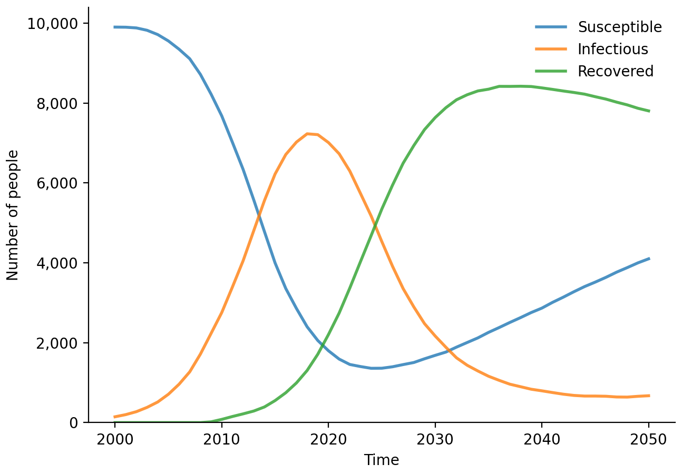

# R-Starsim

[Starsim](https://starsim.org) is a framework for modeling the spread of diseases among agents via dynamic transmission networks. R-Starsim is a wrapper that facilitates the usage of Starsim from R. It uses [reticulate](https://rstudio.github.io/reticulate/index.html) to communicate between Python and R. Full documentation is available at https://r.starsim.org.


## Installation

R-Starsim will be released on CRAN in future, but for now it can be installed via GitHub:

```R
# install.packages("devtools")
devtools::install_github("starsimhub/rstarsim")
library(starsim)
init_starsim()
```

If you do not already have a `reticulate` Python environment set up, R-Starsim will try to make one for you (by downloading Miniconda, creating an `r-reticulate` environment, and activating it).

If you want to reinstall Starsim (e.g. to update the version), you can use:
```R
library(starsim)
reinstall_starsim()
```

If you already have Starsim installed in a Python (specifically `conda`) environment, you can skip installation and proceed directly to using Starsim in R. If the environment you've installed Starsim into is called `starsim_env`, then you can start using Starsim with:
```R
library(starsim)
load_starsim("starsim_env")
```

If you've installed it into your base `conda` environment, then you can simply use `load_starsim("base")`.


## Usage

All Starsim Python functions and classes are available in R. In Python, usage is typically `import starsim as ss`. To emulate this behavior in R, Starsim is made available as the variable `ss`, e.g. `sim = ss.Sim()` in Python becomes `sim <- ss$Sim()` in R. In addition, major Starsim classes (such as `Sim`, `Network`, `Disease`, etc.) are imported directly into the R namespace (e.g. `sim <- Sim()` also works).


## Example

```R
# Load Starsim
library(starsim)
load_starsim()

# Set the simulation parameters
pars <- list(
    n_agents = 10000,
    birth_rate = 20,
    death_rate = 15,
    networks = list(
        type = 'randomnet',
        n_contacts = 4
    ),
    diseases = list(
        type = 'sir',
        dur_inf = 10,
        beta = 0.1
    )
)

# Create, run, and plot the simulation
sim <- ss$Sim(pars)
sim$run()
sim$diseases$sir$plot()
```


## Contact

Questions? Comments? Bugs? Please [open an issue](https://github.com/starsimhub/rstarsim/issues/new/choose) or [email us](mailto:info@starsim.org) for help.
