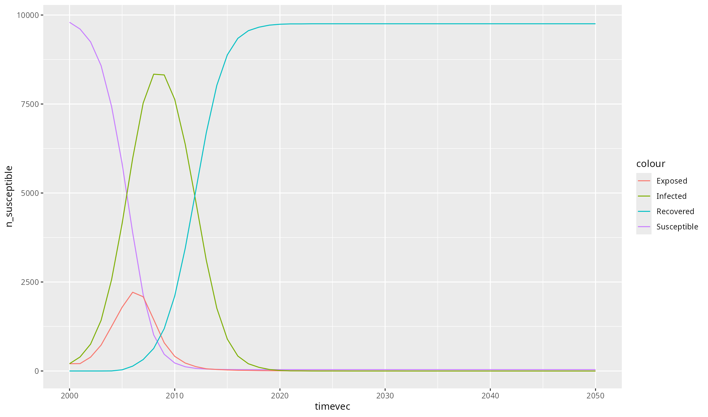

```{r setup, include = FALSE}
knitr::opts_chunk$set(
  collapse = TRUE,
  comment = "#>"
)
```

## Advanced usage example

This example illustrates how to creating a custom disease module. It is a translation of Starsim's [Diseases developer tutorial](https://docs.starsim.org/tutorials/dev_tut_diseases.html) to R.

To recap that tutorial, the main customizations we are performing here are:
1. In `__init__()` we added the extra pars and states needed for our model.
2. We defined infectious to include both infected and exposed people - this means that we can just reuse the existing logic for how the SIR model handles transmission.
3. We updated `step_state()` and `step_die()` to include changes to the exposed state.
4. We rewrote `set_prognoses()` to include the new exposed state.

```{r, eval = FALSE}
library(starsim)
load_starsim()

# Create a new class for an SEIR disease
SEIR <- PyClass("SEIR", 
  inherit = ss$SIR, # Inherit from the SIR class
  defs = list(`__module__` = "SEIR",

    # Define the __init__ method
    `__init__` = function(self, pars = py_none(), ...) {
      ss$SIR$`__init__`(self) # Call the parent init method

      # Parameters specific to SEIR: duration of exposure
      self$define_pars(
          dur_exp = ss$lognorm_ex(0.5), # Define an explicit ("ex") lognormal distribution with a mean of 0.5
      )
      self$update_pars(pars, ...)

      # Additional states beyond the SIR ones
      self$define_states(
          ss$State('exposed', label='Exposed'),
          ss$FloatArr('ti_exposed', label='TIme of exposure'),
      )
      return(py_none())
    },

    # Make all the updates from the SEIR model
    step_state = function(self) {
        ss$SIR$step_state(self) # Perform SIR updates

        # Additional updates: progress exposed -> infected
        infected <- self$exposed & (self$ti_infected <= self$ti) # Check who is scheduled to become infected
        self$exposed[infected] = FALSE
        self$infected[infected] = TRUE
        return(py_none())
    },

    # Ensure that exposed is set to False for people who die
    step_die = function(self, uids) {
      ss$SIR$step_die(self, uids) # Perform SIR updates
      self$exposed[uids] = FALSE
      return(py_none())
    },

    # Carry out state changes associated with infection
    set_prognoses = function(self, uids, sources = py_none()) {
      ss$SIR$set_prognoses(self, uids, sources) # Perform SIR updates
      
      # Define handling of exposure
      ti <- self$ti # Current module time index
      self$susceptible[uids] = FALSE # People exposed are no longer susceptible
      self$exposed[uids] = TRUE # But they are exposed
      self$ti_exposed[uids] = ti # Track what time they got infected

      # Calculate and schedule future outcomes
      dur_exp <- self$pars['dur_exp']$rvs(uids) # Get random numbers for the duration of exposure
      self$ti_infected[uids] <- ti + dur_exp # Set the time at which people move from exposed to infected
      dur_inf <- self$pars['dur_inf']$rvs(uids) # Set the duration of infection
      will_die <- self$pars['p_death']$rvs(uids) # Choose who will die
      self$ti_recovered[uids[!will_die]] <- ti + dur_inf[!will_die] # Schedule people to recover
      self$ti_dead[uids[will_die]] <- ti + dur_inf[will_die] # Schedule people to die

      # Update result count of new infections
      self$results['new_infections'][self$ti] = length(uids) # Store the number of new infections in the results
      return(py_none())
    },

    # Plot results using ggplot
    plot = function(self) {
      library(ggplot2)
      df <- self$results$to_df() # Export results to an R data.frame

      fig <- ggplot(df, aes(timevec)) + 
        geom_line(aes(y = n_susceptible, colour = "Susceptible")) + 
        geom_line(aes(y = n_exposed, colour = "Exposed")) +
        geom_line(aes(y = n_infected, colour = "Infected")) +
        geom_line(aes(y = n_recovered, colour = "Recovered"))
      
      print(fig)
      return(fig)
    }
  )
)

# Run and plot
seir <- SEIR() # Create the disease module
sim <- ss$Sim(diseases=seir, networks='random') # Create a simple sim with default parameters
sim$run() # Run
sim$diseases$seir$plot() # Call the custom ggplot function
```



### Next steps

For more intermediate examples between the simple example (which is very simple) and this one (which is very advanced), please see the [Starsim documentation](https://docs.starsim.org). If you still have questions, please [reach out to us](mailto:info@starsim.org) -- we're very happy to help!