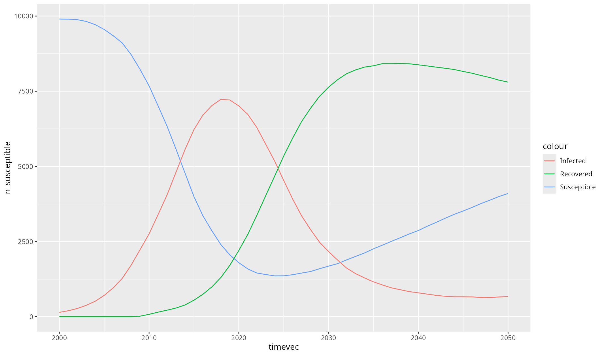

```{r setup, include = FALSE}
knitr::opts_chunk$set(
  collapse = TRUE,
  comment = "#>"
)
```

## Simple usage example

This example walks through the steps for creating and running a simple Starsim simulation. Here, "simple" means that you are configuring (i.e., setting the parameters for) existing Starsim modules, rather than writing new ones.


### Load Starsim

The `starsim` package only contains three functions -- `init_starsim()`, `reinstall_starsim()`, and `load_starsim()`. The first one you should only need to do once, the second one you might not need to do at all, and the third one is how you access all of Starsim's functionality:
```{r, eval=FALSE}
library(starsim)
load_starsim()
```

For the most "Pythonic" experience, you can do everything via the `ss` variable, which corresponds to `import starsim as ss` in Python. However, for a more "R-ish" experience, you can also use some of the most important classes directly, all of which can also be accessed via `ss`. For example, `sim <- ss$Sim()` and `sim <- Sim()` are identical.

For ease of use, Starsim also imports several key `reticulate` functions, including `import` and `PyClass`.

### Configure a Starsim run

Starsim simulations can be configured either by supplying a list of *parameter values*, or a list of *objects*. These two approaches are equivalent. For simple sims, it's usually easiest to use parameter values. For more complex sims, it's usually easiest to use objects.

Here's what it looks like to configure a sim using a list of parameter values:
```{r, eval=FALSE}
pars <- list(
  n_agents = 10000,
  birth_rate = 20,
  death_rate = 15,
  networks = list(
    type = 'randomnet',
    n_contacts = 4
  ),
  diseases = list(
    type = 'sir',
    dur_inf = 10,
    beta = 0.1
  )
)
```

Here's the identical simulation, but configured using objects:
```{r, eval=FALSE}
n_agents <- 10000
births <- ss$Births(birth_rate=20)
deaths <- ss$Deaths(death_rate=15)
random <- ss$RandomNet(n_contacts=4)
sir <- ss$SIR(dur_inf=10, beta=0.1)
```


### Create and run a sim

To create a sim using parameters, we can simply supply that as an argument:
```{r, eval=FALSE}
sim <- Sim(pars)
```

Any valid parameter name (e.g. `networks`) can also be supplied directly to a sim. So our "object sim" would look like this:
```{r, eval=FALSE}
sim2 <- Sim(
  label = 'Objects',
  n_agents = n_agents,
  demographics = c(births, deaths),
  networks = random,
  diseases = sir
)
```

Now, let's run both sims and confirm that they match:
```{r, eval=FALSE}
sim$run()
sim2$run()

#> Initializing sim with 10000 agents
#>   Running 2000.0 ( 0/51) (0.00 s)  ———————————————————— 2%
#>   Running 2010.0 (10/51) (0.08 s)  ••••———————————————— 22%
#>   Running 2020.0 (20/51) (0.17 s)  ••••••••———————————— 41%
#>   Running 2030.0 (30/51) (0.24 s)  ••••••••••••———————— 61%
#>   Running 2040.0 (40/51) (0.31 s)  ••••••••••••••••———— 80%
#>   Running 2050.0 (50/51) (0.39 s)  •••••••••••••••••••• 100%
#> Sim(n=10000; 2000—2050; networks=randomnet; demographics=births, deaths; diseases=sir)
#> 
#> Initializing sim "Objects" with 10000 agents
#>   Running "Objects": 2000.0 ( 0/51) (0.00 s)  ———————————————————— 2%
#>   Running "Objects": 2010.0 (10/51) (0.07 s)  ••••———————————————— 22%
#>   Running "Objects": 2020.0 (20/51) (0.15 s)  ••••••••———————————— 41%
#>   Running "Objects": 2030.0 (30/51) (0.23 s)  ••••••••••••———————— 61%
#>   Running "Objects": 2040.0 (40/51) (0.30 s)  ••••••••••••••••———— 80%
#>   Running "Objects": 2050.0 (50/51) (0.38 s)  •••••••••••••••••••• 100%
#> Sim(Objects; n=10000; 2000—2050; networks=randomnet; demographics=births, deaths; diseases=sir)
```

Let's check that the results of the two sims match:
```{r, eval=FALSE}
ss$check_sims_match(sim, sim2)
#> Sims match
```


### Built-in plotting

To plot all the results in a sim, we can call `sim$plot()`:
```{r, eval=FALSE}
sim$plot()
```


(If your plot doesn't show up or looks stupendously ugly, please see the troubleshooting section of the readme.)

To plot just the results from our disease module, we can call `plot()` for that disease:
```{r, eval=FALSE}
sim$diseases$sir$plot()
```


### Custom plotting

Eventually, you are going to want to do some custom plotting. The easiest way to do this is to export your results to a dataframe, and then plot as you usually would. For example:

```{r, eval=FALSE}
library(ggplot2)
df <- sim$results$sir$to_df()

ggplot(df, aes(timevec)) + 
  geom_line(aes(y = n_susceptible, colour = "Susceptible")) + 
  geom_line(aes(y = n_infected, colour = "Infected")) +
  geom_line(aes(y = n_recovered, colour = "Recovered"))
```


