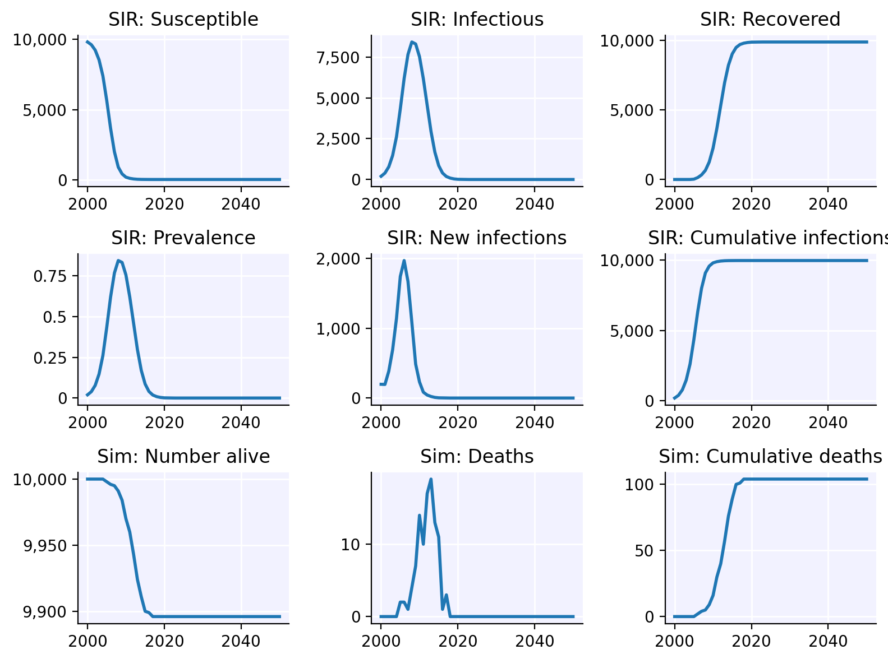

```{r setup, include = FALSE}
knitr::opts_chunk$set(
  collapse = TRUE,
  comment = "#>"
)
```

## Installing Starsim

Installing Starsim should be straightforward, whether or not you have Python or `reticulate` already configured on your computer.

1. Install `devtools` if you haven't already:
```{r, eval=FALSE}
install.packages("devtools")
```

2. Install the R-Starsim package. This installs the R _wrapper_ for Starsim, but not Starsim itself yet.
```{r, eval=FALSE}
devtools::install_github("starsimhub/rstarsim")
```

3. Load the wrapper:
```{r, eval=FALSE}
library(starsim)
```

4. Finally, we install Starsim itself. This step will also install Python (specifically Miniconda) if needed, and will create a virtual environment (`r-reticulate`) unless it already exists. Note that this step may take some time (3-10 min depending on your computer and internet connection).
```{r, eval=FALSE}
init_starsim()
```

5. You can test the install with `ss$demo()`, which should run a sim and plot the results.
```{r, eval=FALSE}
load_starsim()
ss$demo()
```

